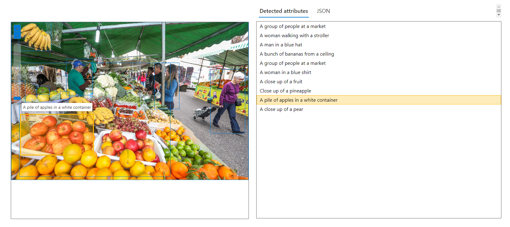
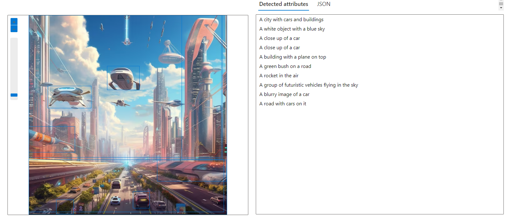
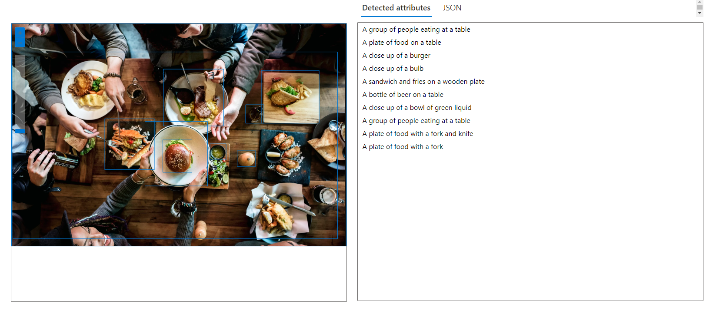
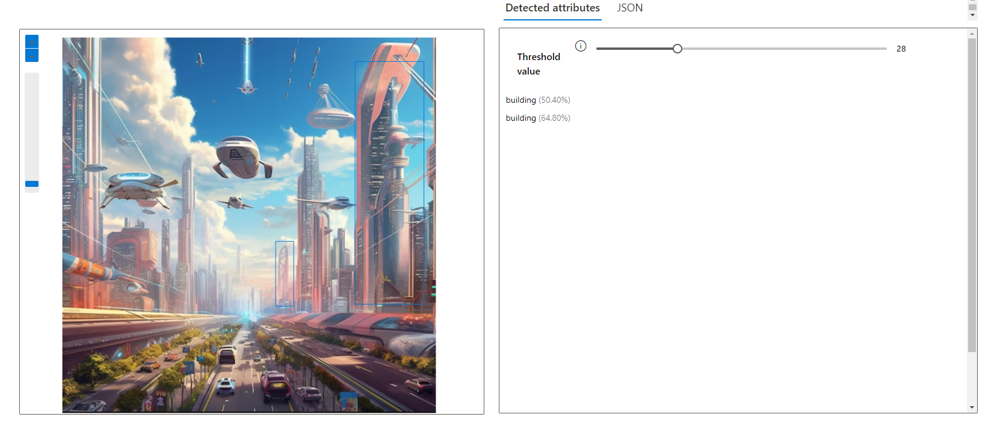
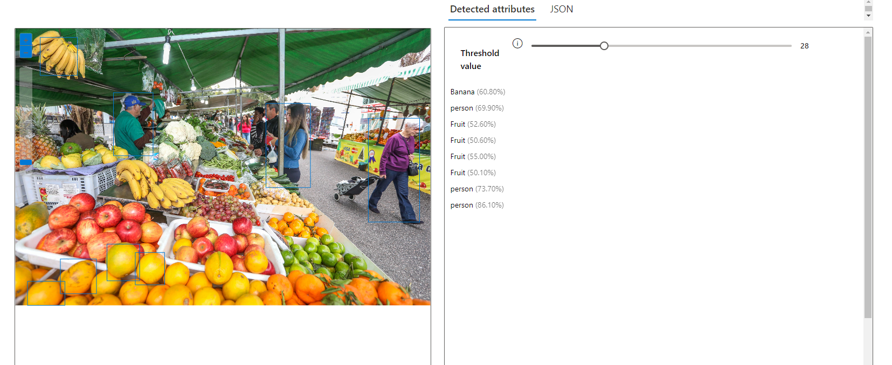
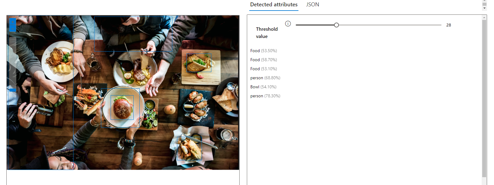
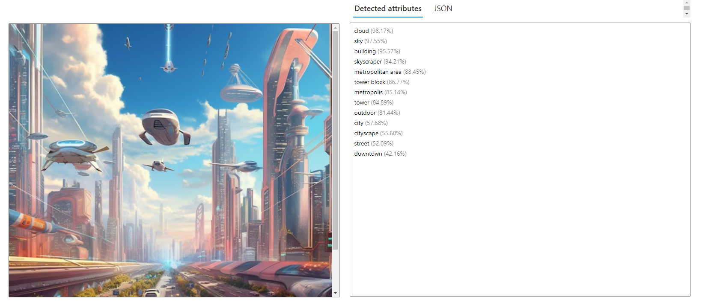
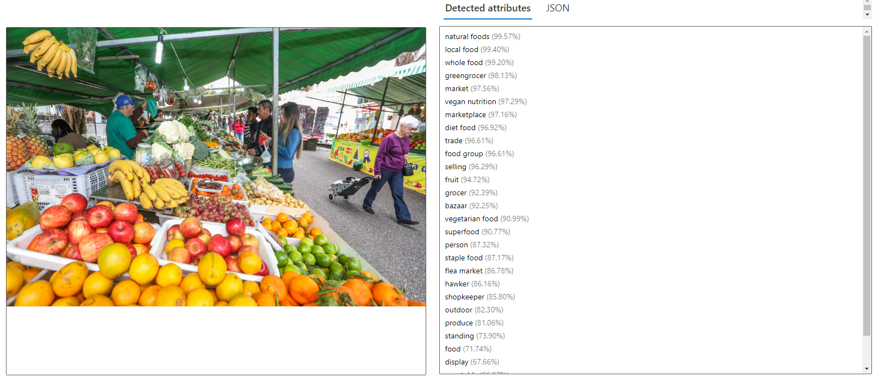
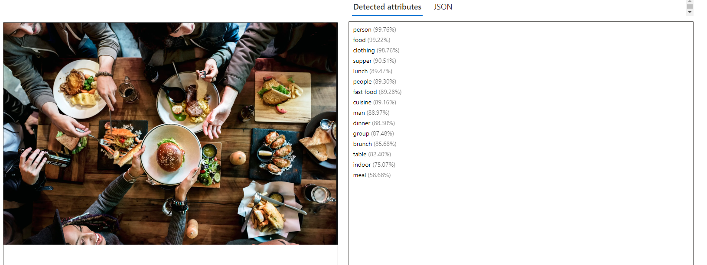

# Analyze images in Vision Studio
Welcome to the repository for the SECOND challenge of the Microsoft Azure AI Fundamentals, a collaboration between DIO and Microsoft. Here, you'll find my results for image analysis using AI Vision Studio.
____

### Getting Started
To complete this lab, you'll need the following prerequisites:

- An Azure subscription. You can subscribe into the [Azure Students](https://azure.microsoft.com/pt-br/free/students) which provides eligible students with $100 to kickstart their learning journey. 
- An Azure Machine Learning workspace already configured.

For a comprehensive tutorial with all the necessary parameters to succeed, follow this [link](https://microsoftlearning.github.io/mslearn-ai-fundamentals/Instructions/Labs/03-image-analysis.html)
____

1. *Environment Configuration:* To begin testing, I followed the tutorial in the documentation to create a resource. Then, I accessed the Vision Studio portal and selected the newly created resource to start the tests.

2. *The analysis* I analyzed 3 images using 3 different models:

### 1. Add dense captions to images:
  

____

### 2. Detect common objects in images:
  

____

### 3. Extract common tags from images.
  
