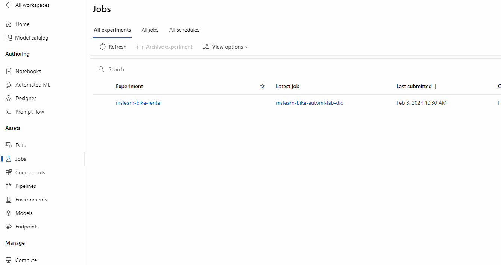
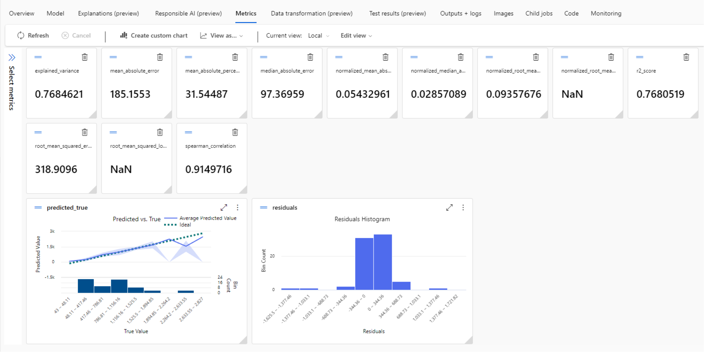
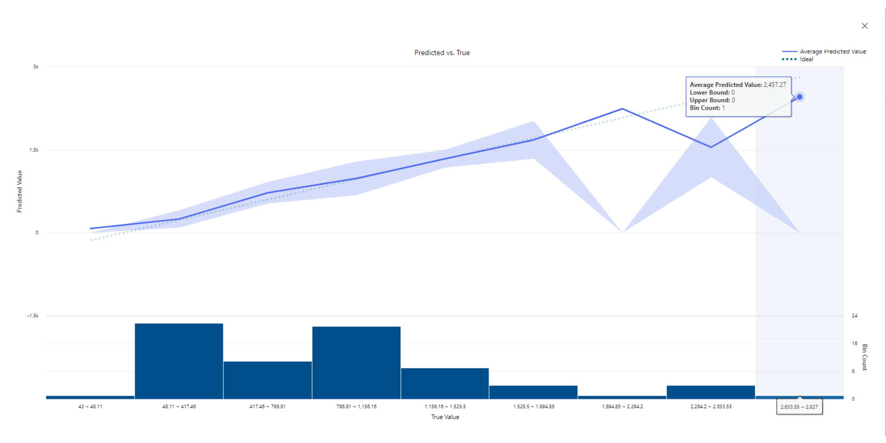
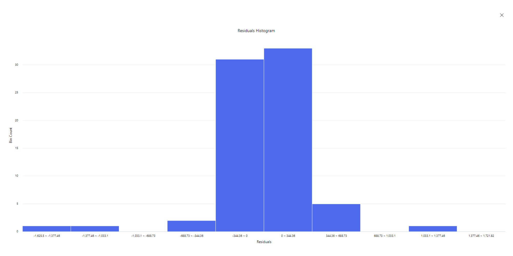
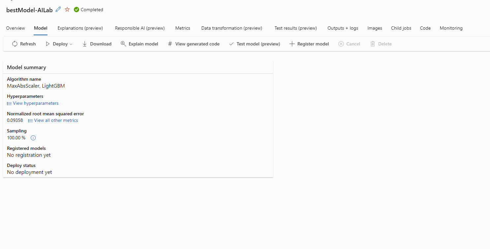
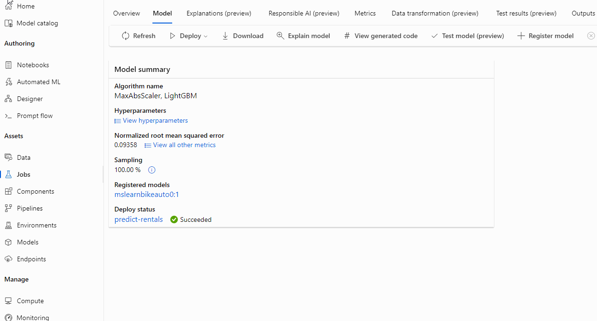

# Explore Automated Machine Learning in Azure ML
Welcome to the repository for the first challenge of the Microsoft Azure AI Fundamentals, a collaboration between DIO and Microsoft. Here, you'll find my  guide on configuring and deploying a Machine Learning Model using Azure Automated Machine Learning.
____

### Getting Started
To complete this lab, you'll need the following prerequisites:

- An Azure subscription. You can subscribe into the [Azure Students](https://azure.microsoft.com/pt-br/free/students) which provides eligible students with $100 to kickstart their learning journey. 
- An Azure Machine Learning workspace already configured.

For a comprehensive tutorial with all the necessary parameters to succeed, follow this [link](https://microsoftlearning.github.io/AI-900-AIFundamentals/instructions/02-module-02.html)
____

1. *Environment Configuration:* Begin by setting up my workspace environment according to the template provided in the tutorial. Once your model is configured, proceed with initiating the training process. The training took approximately 15 minutes, as configured.

2. *Best Model Selection:* Upon completion of the training, review the best model summary. Select the best algorithm to view its details and continue with the deployment.

3. *Model Deployment:* Proceed with the deployment of the selected model.

4. *Testing:* Finally, test the deployed model using the provided JSON template:
~~~json
 {
   "Inputs": { 
     "data": [
       {
         "day": 1,
         "mnth": 1,   
         "year": 2022,
         "season": 2,
         "holiday": 0,
         "weekday": 1,
         "workingday": 1,
         "weathersit": 2, 
         "temp": 0.3, 
         "atemp": 0.3,
         "hum": 0.3,
         "windspeed": 0.3 
       }
     ]    
   },   
   "GlobalParameters": 1.0
 }
 ~~~
 